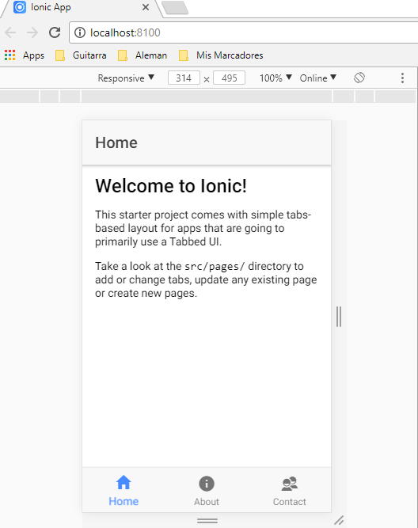
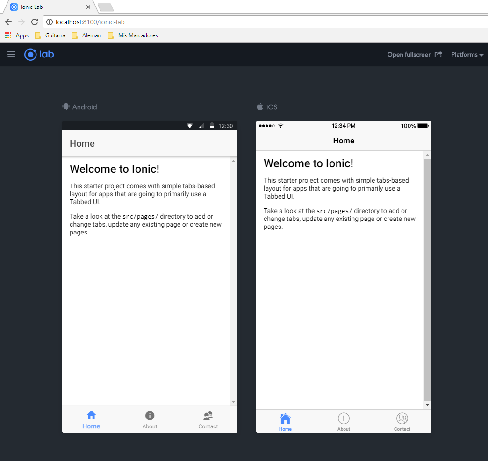

# Lista de deseos - IONIC 2 APP

## ¿Qué aprenderemos en esta sección?

A lo largo de esta sección crearemos una aplicación que correrá en nuestro dispositivo Android o IOS, y con ello aprenderemos sobre:

* Uso del local storage guardar localmente información para nuestras aplicaciones.
Introducción a ionic 2.
* Uso del framework de ionic 2.
* Uso de servicios que afectan el local storage.
* Uso de ionic view para desplegar nuestra aplicación
* Aprenderemos a controlar estilos usando Angular.
* Manejo de la información a través de servicios ( update, delete, insert y select ) al local storage.
* Aprenderemos a utilizar pipes impuros para realizar filtros.

## IONIC

Para poder utilizar **IONIC** , es necesario utiilizar **git**, dado que los deploys se realizan a través de ``push`` al repositorio de **IONIC**.  

### Instalar **IONIC**

>[ionicframework.com](https://ionicframework.com/)

* Ejecutar el siguiente comando como _**Administrador**_:  
  `` npm install -g cordova ionic ``

### Crear una aplicación

* Ejecutar el siguiente comando dentro de la carpeta donde se quiere crear el proyecto:

  ``ionic start myApp tabs`` ó ``ionic start myApp blank`` ó ``ionic start myApp sidemenu``  

### Ejecutar la aplicaciones

* Para ejecutar la aplicación en forma local, ejecutar el siguiente comando dentro de la carpeta donde se encuentra la aplicación IONIC.  
  ``ionic serve``  

  Se inicializa el server y hostea la aplicación por default en el puerto 8100:  

  

  Se le puede agregar a la ruta ``/ionic-lab`` para ver todos los dispositivos a la vez:  

  

### IONIC Dashborad

* Instalar la aplicación desde el **Playstore** para poder probar las aplicaciones desde el celular.
* Verificar si esta instalada en nuestra Computadora: ``ionic config set -g backend pro``
* Desde el **Git bash** ejecutar el siguiente comando para agregar la apliacion a ionic dashboard: ``ionic link --create``, colocar luego el nombre de la aplicación.
* Para subir la aplicacion al IONIC, ``git push ionic master``

## Componentes

[Componentes](componentes.md)

## Services

[Servicios](services.md)
