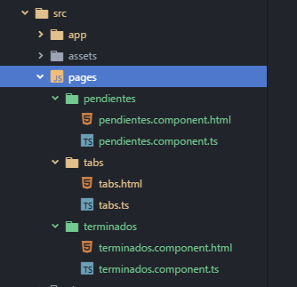

# Components

[VOLVER A README.md](README.md)

Los componentes en un proyecto **IONIC** se colocan dentro de la carpeta ``src/pages``.

* Cada componentes tiene una carpeta y esta carpeta tiene a su vez al menos 2 archivos:



* ``xxxxxx.component.ts``
  ```typescript
  import { Component, OnInit } from '@angular/core';
  
  @Component({
    selector: 'app-pendientes',
    templateUrl: 'pendientes.component.html',
  })
  export class PendientesComponent implements OnInit {
    constructor() {  }
  
    ngOnInit() {}
  }
  ```

* ``xxxxx.component.html``
  ```html
  <ion-header>
    <ion-navbar>
      <ion-title>Listsa de Pendientes</ion-title>
    </ion-navbar>
  </ion-header>
  <ion-content padding>
    <h1>Pendientes !!!</h1>
  </ion-content>
  ```

* El componente **tab** tiene tiene la siguiente estructura:
  * ``tabs.ts``
  ```typescript
    import { Component } from '@angular/core';
    import { PendientesComponent } from '../pendientes/pendientes.component';
    import { TerminadosComponent } from '../terminados/terminados.component';
    
    @Component({
      templateUrl: 'tabs.html'
    })
    export class TabsPage {
    
      tab1Root = PendientesComponent;
      tab2Root = TerminadosComponent;
    
      constructor() {
    
      }
    }
  ```
   
  * ``tabs.html``
  ```html
    <ion-tabs>
      <ion-tab [root]="tab1Root" tabTitle="Pendientes" tabIcon="home"></ion-tab>
      <ion-tab [root]="tab2Root" tabTitle="Terminados" tabIcon="information-circle"></ion-tab>
    </ion-tabs> 
  ```

* Importar y referenciar los componentes en el archivo ``app.modules.ts``

```typescript
  ...
  
  import { TabsPage } from '../pages/tabs/tabs';
  import {PendientesComponent} from '../pages/pendientes/pendientes.component';
  import {TerminadosComponent} from '../pages/terminados/terminados.component';
  
  ...
  
  @NgModule({
    declarations: [
      MyApp,
      TabsPage,
      PendientesComponent,
      TerminadosComponent
    ],
    imports: [
      BrowserModule,
      IonicModule.forRoot(MyApp)
    ],
    bootstrap: [IonicApp],
    entryComponents: [
      MyApp,
      TabsPage,
      PendientesComponent,
      TerminadosComponent
    ],
    providers: [
      StatusBar,
      SplashScreen,
      {provide: ErrorHandler, useClass: IonicErrorHandler}
    ]
  })
  export class AppModule {}
```

[Video: Componentes, pendientes, estructura y tab](https://www.udemy.com/angular-2-fernando-herrera/learn/v4/t/lecture/6455034?start=0)
