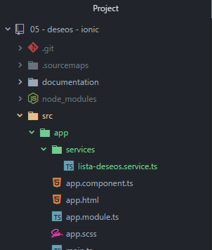

# Services

[VOLVER A README.md](README.md)  

* Los servicios se deben colocar dentro de la carpeta ``app\services`` con el nombre ``xxxxxxx.service.ts``:  

    

* Los servicios poseen la siguiente estructura básica de código:
  ```typescript
  import { Injectable } from '@angular/core';

  @Injectable()
  export class LiastaDeseosService {
    constructor() {
       console.log("Servicio inicializado...")
    }
  }
  ```

* Los servicios deben ser importados en el archivo ``app.module.ts`` para poder ser utilizados.  

  ```typescript
    //services
    import {LiastaDeseosService} from './services/lista-deseos.service';
  ```

  ```typescript
    @NgModule({
    declarations: [
      ...
    ],
    imports: [
      ...
    ],
    bootstrap: [IonicApp],
    entryComponents: [
     ...
    ],
    providers: [
      StatusBar,
      SplashScreen,
      LiastaDeseosService,
      {provide: ErrorHandler, useClass: IonicErrorHandler}
    ]
  })
  export class AppModule {}
  ```

 * Utilizar el servicio en otro componente, en este caso ``pendientes.component.ts``:

```typescript
  import { Component, OnInit } from '@angular/core';
  import {LiastaDeseosService} from '../../app/services/lista-deseos.service';

  @Component({
    selector: 'app-pendientes',
    templateUrl: 'pendientes.component.html',
  })
  export class PendientesComponent implements OnInit {
    constructor(private _liastaDeseos : LiastaDeseosService) {  }

    ngOnInit() {}
  }
```

[Video: Componentes, pendientes, estructura y tab](https://www.udemy.com/angular-2-fernando-herrera/learn/v4/t/lecture/6457882?start=0)
